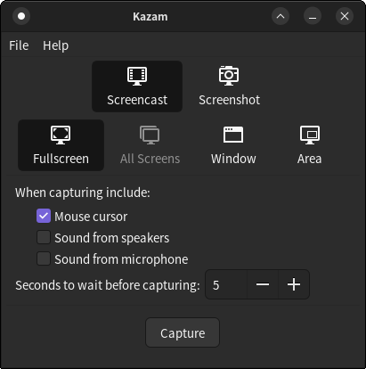
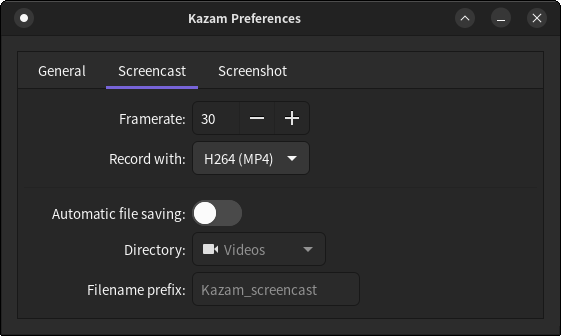

## 录屏

在ubuntu下使用kazam录屏，首先安装kazam

```shell
sudo apt install kazam
```

kazam依赖于Audio Server，如果kazam无法工作可能是Audio server没有起来，需先安装pulseaudio

```shell
sudo apt install pulseaudio
# 设置开机启动
systemctl --user enable pulseaudio
# 启动
systemctl --user start pulseaudio
```

这样kazam就可以工作了

打开主界面



其中Scrrencast是录屏，Fullscreen是录全屏， Window是选择窗口录制，Area是选择区域录制

在File里可以设置相关参数



在Screencast里可以选择录制的格式和解码方式和帧率。

点击主页的Capture开始录制，录制结束后在任务栏上找到相关图标点击Finish capure点击结束保存视频

录制的视频通常保存在~/Videos目录下

## 转换Windows可观看视频

kazam录制的视频默认无法在Windows系统中打开，需要做转换

首先确保安装了ffmpeg，ubuntu安装如下

```shell
sudo apt install ffmpeg
```

windows系统自行到官网下载安装即可

如果录制的是mp4格式的视频

```shell
ffmpeg -i in.mp4 -pix_fmt yuv420p -c:a copy -movflags +faststart out.mp4
```

转换之后可以在Windows中播放

如果录制的是AVI格式的原始数据的视频

```shell
ffmpeg -i in.avi -c:v libx264 -crf 20 -pix_fmt yuv420p -c:a copy -movflags +faststart out.mp4
```

格式从avi转换到mp4

